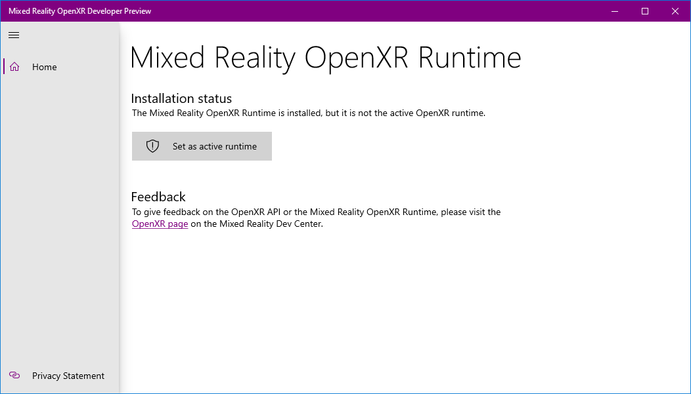

# OpenXR

OpenXR is an open royalty-free standard from [Khronos](https://www.khronos.org/) that provides native access to a wide range of devices from many vendors that span across the [mixed reality spectrum](mixed-reality.md).

With OpenXR, you can build applications that target both holographic devices (like HoloLens 2) that place digital content in the real world as if it were really there, as well as immersive devices (like Windows Mixed Reality headsets for desktop PCs) that hide the physical world and replace it with a digital experience.  With OpenXR, you can write code once that is portable across a wide range of hardware platforms.

The OpenXR standard is currently in a provisional phase, with an initial OpenXR 0.90 spec released for feedback.  For more information on OpenXR, including access to the [provisional 0.90 spec](https://www.khronos.org/registry/OpenXR/specs/0.90/man/html/) and [headers](https://github.com/KhronosGroup/OpenXR-Docs/tree/master/include/openxr), see the [Khronos OpenXR page](https://www.khronos.org/openxr/).

## Setting up the Mixed Reality OpenXR Developer Preview

You can try out the provisional OpenXR 0.90 API today using the Mixed Reality OpenXR Developer Preview.  This early runtime enables applications targeting the OpenXR 0.90 API to target Windows Mixed Reality immersive headsets on the desktop.  If you don't have access to a headset, you can use the Windows Mixed Reality Simulator instead.

> [!NOTE]
> These early Developer Preview instructions include a few manual steps.  Check back later in the week for a more streamlined setup process!

To get started with the Mixed Reality OpenXR Developer Preview:

1. Be sure you are running at least the Windows 10 October 2018 Update.  If you're on an earlier version of Windows 10, you can upgrade to the October 2018 Update using the [Windows 10 Update Assistant](https://www.microsoft.com/en-us/software-download/windows10).
1. Set up a Windows Mixed Reality headset or follow the instructions to [enable the Windows Mixed Reality simulator](using-the-windows-mixed-reality-simulator.md).
1. Install the Mixed Reality OpenXR Developer Preview by installing [this app from the Windows Store](https://www.microsoft.com/store/productId/9p9596djj19r).  This will keep your machine up to date automatically with the latest version.
1. To set the Mixed Reality OpenXR Developer Preview as your system's active OpenXR runtime, download the [Mixed Reality OpenXR Developer Preview Compatibility Pack](https://aka.ms/openxr-compat) and extract it to a stable location.
1. From an administrator command prompt, run the following command, replacing `<fully-qualified path to MixedRealityRuntime.json>` with the full path to the MixedRealityRuntime.json file you extracted:
   ```
   reg add "HKLM\Software\Khronos\OpenXR\0" /v ActiveRuntime /t REG_SZ /d "<fully-qualified path to MixedRealityRuntime.json>" /reg:64
   ```

### Mixed Reality OpenXR Developer Preview app
If you're running a Windows 10 Insider Preview build of the next version of Windows, you can also try out the [Mixed Reality OpenXR Developer Preview app](https://www.microsoft.com/store/productId/9n5cvvl23qbt).  This app makes it easy to set the active runtime, and will soon let you explore other debug information as well.



## Building a test OpenXR app

> [!NOTE]
> Instructions for building a test OpenXR app coming later today!

## Feedback
To give feedback on the [OpenXR Provisional 0.90 specification](https://www.khronos.org/registry/OpenXR/specs/0.90/man/html/), please visit the [Khronos OpenXR Forums](https://forums.khronos.org/), [Slack Channel](https://khr.io/slack) and [Issue Tracker](https://github.com/KhronosGroup/OpenXR-Docs).

## See also
* [More information on OpenXR](https://www.khronos.org/openxr/)
* [OpenXR Provisional 0.90 specification](https://www.khronos.org/registry/OpenXR/specs/0.90/man/html/)
* [OpenXR Provisional 0.90 headers](https://github.com/KhronosGroup/OpenXR-Docs/tree/master/include/openxr)
